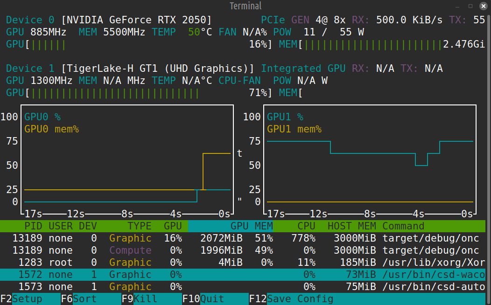
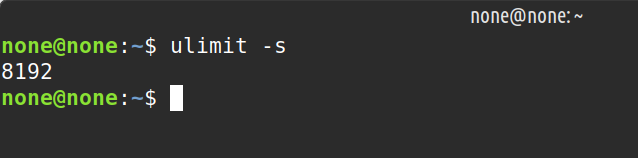

# ONC (Observe and Conclude) 

## Sample test case showing the Nvidia RTX 2050 performing computation occuping around 2 gib of v-ram 

## Description

Rust-based **GPU compute engine** that utilizes Vulkan compute shaders to perform high-precision **(f64)** numerical computations directly on the GPU. It integrates a SQLite database to manage sample sizing, configuration metadata, and computation results — providing a structured, data-driven execution model for **parallel workloads**.

The system is designed to maximize GPU and CPU parallelism through a multithreaded architecture. Each Vulkan compute queue is managed by a dedicated Rust thread, ensuring that GPU time is never wasted waiting for CPU-bound operations. This allows simultaneous dispatch of multiple compute workloads, improving throughput and minimizing idle cycles on both CPU and GPU.

## Test Database sample (10 million rows of 5 columns of random 5 floating points 64 bits each)
### NOTE: Sample data size of sqlite db has been reduced to 47 mb due to file limitations on direct upload on github (*sqlite being a portable database is  chosen for this demo*)

## Test Case
- __Input equation is given in string given by the user__
  - write_shaders::write(String::from("x0a"), String::from("(a+b+c)"))
  - The equation also supports the **abs()** function therefore as long as the mathematical way to place the simple braces is followed equation can also be complicated like => ___((a * 3.14) / abs(b) * 100___, **constants** are  supported as well,
  - **x0a** is the shader file name where the string **(a+b+c)** is written to a shader using ___std::regex___ and the **.comp (compute)**  shader file is written further converting the compiled file to the compiled file that the GPU can read, including the ***meta-data*** for the shader using the ___std::serde_json___ 
- __Computed Equation__

- **where in:**
  - a = t1
  - b = t2
  - c = t3  

- **Size of Tested GPU RAM - 4gb**
- **Compute Queues (meant for numeric calculations) in GPU  - 8**
- **Size of input data =>**
    - t1 is **f64** and size of array is **10 million**, thereby, 8 bytes * 10 million ~ **76.294 MiB**

    - t2 is **f64** and size of array is **10 million**, thereby, 
    8 bytes * 10 million ~ **76.294 MiB**

    - t3 is **f64** and size of array is **10 million**, thereby, 8 bytes * 10 million ~ **76.294 MiB**
- **Size of output data =>**
    - outData is f64 with the same size of 10 milion, so ~ **76.294 MiB**

**Concurrency in GPU**
- ***8 queues:*** *act similar to CPU's single thread, therefore simultaneously,* 8 seperate equations can be run but for the test same eqn is being used

**Concurrency in CPU**
- **8 kernal threads (as per the previously iterated GPU queue's count)** with the default **stack size of 8192 KB**

- All the **8 threads** created run concurrently to submit task to **GPU** and wait till GPU finishes execution  

- On completion of the tasks on the GPU end the **thread** receives the ***std::sync::mpsc*** call to re-submit the data using **same thread** implementing a ***threadpool-like*** behaviour

## Key Features

__Rust Multithreaded Architecture__ – Each compute queue is controlled by an independent thread. Work is distributed using mpsc channels, ensuring asynchronous task submission and immediate GPU utilization.

__FFI and Memory Safety__ – Interacts with Vulkan’s C API through Rust’s ffi, mem, and ptr modules, ensuring efficient low-level access without sacrificing safety.

__Full CPU–GPU Parallelism__ – While one thread prepares input buffers or database entries, another dispatches and synchronizes compute operations on a separate queue, achieving true pipeline parallelism.

__Dynamic Task Scheduling__ – The CPU dynamically assigns compute tasks to available queues, balancing workloads to avoid GPU stalls or synchronization bottlenecks.

__Data Serialization & Parsing__ – Uses serde for structured serialization and regex for input validation and parsing.

__System Integration__ – Employs fs and process modules for data management and auxiliary task execution.

**Vulkan Compute Backend** – Performs double-precision (f64) mathematical computations on the GPU using compute shaders for high accuracy and speed.

**SQLite Database Integration** – Uses rusqlite for persistent storage of dataset configurations, sample sizes, and results.

## Multithreading overview GPU, CPU

**Queue Assignment:** At initialization, each available Vulkan compute queue is assigned a dedicated Rust thread.

**Channel Communication:** A central dispatcher uses mpsc channels to send computation tasks to these threads.

**Asynchronous Submission:** Each thread records command buffers, submits them to its queue, and immediately begins preparing the next workload without waiting for GPU completion.

**Synchronization:** Lightweight Vulkan fences ensure task dependency management without blocking other threads.

## Requirements
- Vulkan API
- OS: Linux (built on ubuntu 22.04 lts)
..........

